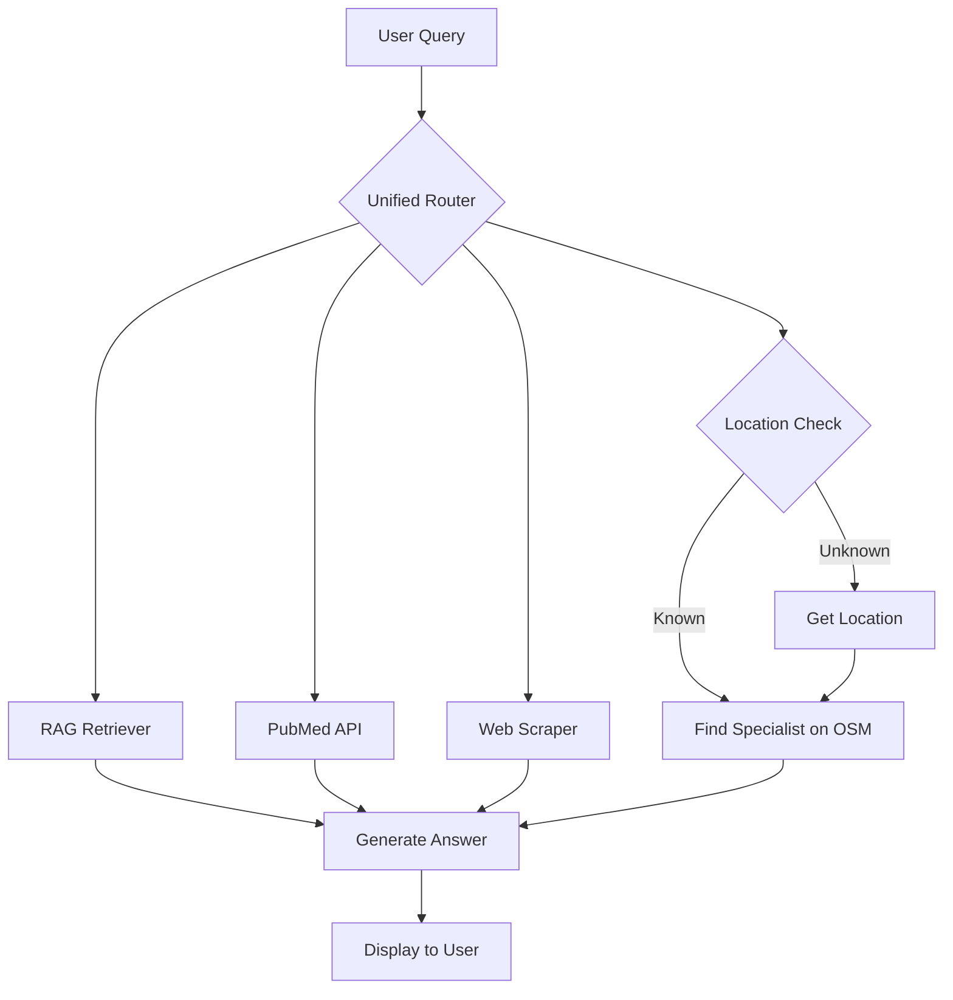

# 🧠 **Intelligent Medical Assistant Agent**

## 📌 **Project Overview**

This project is an advanced, conversational AI medical assistant built on a stateful, multi-tool agentic framework. It goes beyond simple Q\&A by dynamically selecting the best information source for any query, proactively offering supplementary advice, and anticipating user needs by finding nearby medical specialists.

The agent uses a **Retrieval-Augmented Generation (RAG)** architecture with a **Pinecone** vector database as its foundational knowledge, but enhances it with live data from the **PubMed API** and a **web scraper**. All decisions are orchestrated by a central routing brain built with **LangGraph**.

🔹 **Stateful Multi-Tool Agent**: Uses LangGraph to manage conversation state and dynamically route tasks.
🔹 **Dynamic Knowledge Sources**: Chooses between its internal Pinecone DB, live PubMed research, or web scraping for the best context.
🔹 **Proactive & Conversational**: Not only answers questions but offers unsolicited advice and anticipates user needs.
🔹 **Location-Aware**: Integrates a free **OpenStreetMap** tool to find and suggest local specialists with addresses and distances.
🔹 **Modular & Scalable Architecture**: Built with a clean, multi-file Python structure for easy maintenance and expansion.

-----

## ⚙️ **Tech Stack & Architecture**

### **Core Technologies Used**

  - **Agentic Framework**: **LangGraph** for building the stateful, dynamic agent.
  - **LLM**: **Google's Gemini** family for reasoning, routing, and response generation.
  - **Vector Search & Embeddings**: **Pinecone** for high-speed semantic search on a custom medical knowledge base.
  - **Live Data Tools**: **PubMed API** for real-time research, **BeautifulSoup** for web scraping.
  - **Geospatial Tools**: **OpenStreetMap (Overpass API)** and **Haversine** for key-free location finding and distance calculation.
  - **Core Libraries**: LangChain, Python, Dotenv.

### **System Architecture**

The agent's workflow is cyclical and intelligent, managed by a central router that directs tasks to the appropriate tool before synthesizing a final answer.



-----

## 🚀 **Installation & Setup**

### **1️⃣ Clone the Repository**

```bash
git clone <https://github.com/vishwastiwarig/medicalbot_genai>
cd <medicalbot_genai>
```

### **2️⃣ Create an Isolated Environment**

```bash
conda create -n medibot python=3.10 -y
conda activate medibot
```

### **3️⃣ Install Required Dependencies**

```bash
pip install -r requirements.txt
```

### **4️⃣ Set Up API Keys & Environment Variables**

Create a `.env` file in the root directory with your credentials:

```ini
GOOGLE_API_KEY = "************"
PINECONE_API_KEY = "************"
```

### **5️⃣ Ingest Data into Pinecone**

Before running the agent, populate its knowledge base using your local medical documents:

```bash
python ingest.py
```

### **6️⃣ Run the Agent Application**

```bash
python main.py
```

The agent will now be running in your terminal, ready to answer questions.

-----

## 🔬 **Core Functionalities & Innovations**

### **1️⃣ Dynamic Tool-Using Agent**

  - A central **router**, powered by the LLM, analyzes the conversation's state at every turn to decide the single best next action.
  - The agent can seamlessly transition from answering a factual question with RAG to conducting live research on PubMed, to finding a local doctor on OpenStreetMap.

### **2️⃣ Proactive Assistance**

  - The agent is prompted to be more than just a reactive bot. After answering a question, it analyzes the context to provide supplementary advice, such as lifestyle tips or related symptoms to watch for.
  - It anticipates user needs by proactively offering to find relevant local help (e.g., "Would you like me to find a dermatologist near you?").

### **3️⃣ Free & Scalable Geolocation**

  - Uses the **OpenStreetMap Overpass API**, a completely free alternative to paid services like Google Maps.
  - The agent gets the user's location once, caches it in the conversation state, and uses it to find and rank nearby specialists by distance.

-----

## 📂 **Project Structure**

```
📦 medical_agent/
├── 📁 medical_documents/ # PDFs for the knowledge base
├── 📄 config.py          # Handles API keys and constants
├── 📄 tools.py            # Defines all agent tools (RAG, PubMed, OSM, etc.)
├── 📄 agent.py           # Builds and compiles the LangGraph agent
├── 📄 ingest.py          # Script to load data into Pinecone
├── 📄 main.py            # Main entry point to run the application
├── 📄 requirements.txt   # Dependency list
└── 🔑 .env                # API keys (ignored in version control)
```

-----

## 🚀 **Future Enhancements**

🔹 **Containerize with Docker** for consistent deployment.
🔹 **Build a Web Interface** using Streamlit or Flask for a user-friendly experience.
🔹 **Integrate a Reranker Model** to improve the quality of retrieved RAG context.
🔹 **Fine-Tune an LLM** with medical-specific datasets for even higher accuracy.

-----

## 📜 **License**

This project is licensed under the **MIT License**. See the **LICENSE** file for details.
